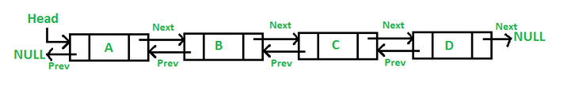

# doubly-linked-list

## Tugas Struktur Data: Linked List

Buatlah program yang mengimplementasikan **Doubly Linked List** dengan spesifikasi sebagai berikut :

### Kelas ListNode

Kelas ini memiliki 3 anggota, yaitu value, next, dan prev.

- float value;
- ListNode next;
- ListNode prev;

prev merupakan pointer yang menujuk ke node sebelum node tersebut, sedangkan next merupakan pointer yang menunjuk ke node setelah node tersebut.

### Kelas DoublyLinkedList

Anggota dari kelas DoublyLinkedList hanya 1, yaitu head.

- ListNode head;

Definisi List empty, yaitu head = null.

Definisi firstNode, yaitu node yang ditunjuk oleh head dan nilai firstNode.prev = null.

Definisi lastNode, yaitu jika lastNode.next = null.

Implementasikan **kedua kelas** tersebut beserta **main program** yang berisi pemanggilan method pada kedua kelas.

### Method yang harus diimplementasikan :

#### Kelas ListNode

- [ ] Konstruktor
- [ ] getValue
- [ ] getNext
- [ ] getPrev
- [ ] setValue
- [ ] setNext
- [ ] setPrev

#### Kelas DoublyLinkedList

- [ ] Konstruktor
- [ ] append
- [ ] insertFirst
- [ ] insertAfter
- [ ] delFirst
- [ ] delAfter
- [ ] delLast
- [ ] print

Jika ada spesifikasi yang tidak jelas, maka boleh dibuat asumsi. Tuliskan asumsi sebagai komentar pada kode program (jika ada).  
Spesifikasi pengumpulan :

1. Seluruh code dibuat dalam 1 file .java
2. Yang diupload hanya 1 file .java (bukan seluruh project netbeans)
3. Pada bagian paling atas file .java, tuliskan Nama, NIM, dan Kelas dalam bentuk komentar
4. Batas pengumpulan tugas : 12 Sept 2018 jam 8 malam (20.00)

Note : Dosen berhak tidak menilai tugas yang tidak sesuai spesifikasi.